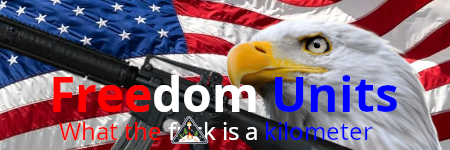

# Freedom Units

A mod that changes the Outer Wilds HUD to displays distances and speeds using *real* patriot-approved units like feet, yards, and miles per hour, instead of those *fancy-pants* units like "meters" and "kilometers per second."

> Note: The mod's description is satire but the functionality is not.
